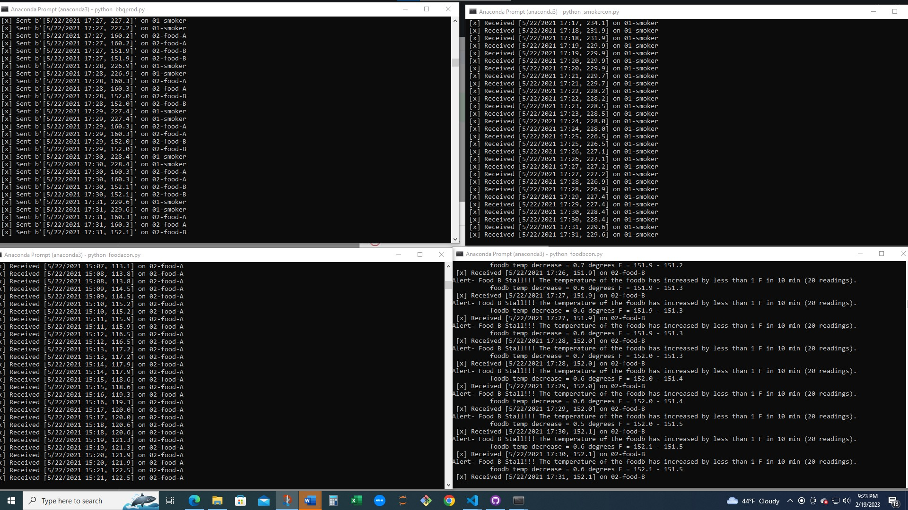
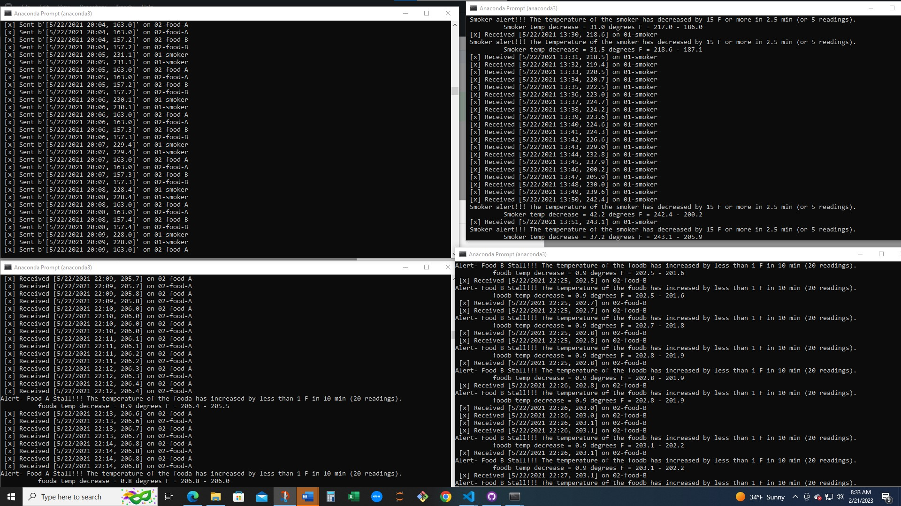

# streaming-06 (Consumers, Windowing, and Multiple Channels)
### Amber Speer
### Module 5 & 6 Assignments
### Feb 13-18, 2023

# Prerequisites

This script require pika, sys, webbrowser, csv, time, and deque.

# How to run the code

In an evironment with the prerequisits installed run the code using the python bbqprod.py command

Once the producer code is running, open 3 more terminal (that have the preequists Installed) and run smokercon.py, foodacon.py, and foodbcon.py

If you need to stop streaming at any poin, press Crtl + C to end the code in the terminal of your choice.

I have included the code to open the RabbitMQ console.  

# Producer and Consumer Terminal Outputs

### Veiw 1

# Veiw 2

